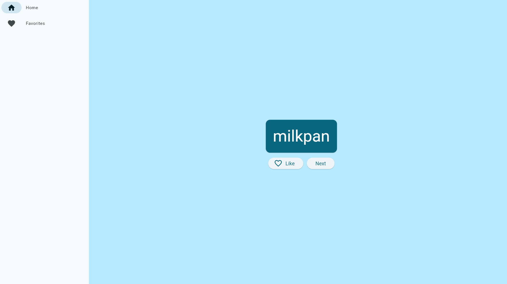

<h1 align = "center"><b>First Flutter App</b></h1>

    <a href="https://first-flutter-app.vercel.app/" target="_blank">Visit Website</a>
    ·
    <a href="https://github.com/sahadcmd/first_flutter_app/issues" target="_blank">Report Bug</a>

   

## About this project 🚀

I Created this new Flutter app as part of my journey to learn Flutter. The app is designed to generate cool-sounding names, like "newstay," "lightstream," "mainbrake," or "graypine." Users can request the next name, favorite the current one, and review their list of favorited names on a separate page. Additionally, the app is fully responsive, adapting seamlessly to different screen sizes.

## How it looks 📷

    

<h5 align="center">Connect with me!</h5>

    <a href="https://www.linkedin.com/in/sahadmahaboobp" target="_blank">LinkedIn</a>

